# 💻 What is Bootstrap 5?


**Bootstrap** is a free, open-source **front-end framework** used to create **responsive and mobile-first websites** easily. It provides **pre-designed CSS and JavaScript components** that help developers build modern web pages quickly without writing all styles from scratch.

## </> Key Features
- ➤ **Responsive Grid System**: Easily create layouts that adapt to any screen size.
- ➤ **Pre-built Components**: Buttons, navbars, cards, modals, forms, and more.
- ➤ **Customizable**: Use variables, Sass, and themes to match your design.
- ➤ **Cross-browser Compatible**: Works well on Chrome, Firefox, Edge, Safari.
- ➤ **Easy Integration**: Can be added via CDN or downloaded locally.

## 🛠️ Why Use Bootstrap 5?
- Speeds up development time ⚡  
- Ensures a **consistent design** across pages  
- Provides **ready-to-use UI components**  
- Supports **mobile-first design**  

## ⚡ Example Code
```html
<!DOCTYPE html>
<html lang="en">
<head>
  <meta charset="UTF-8">
  <meta name="viewport" content="width=device-width, initial-scale=1.0">
  <link href="https://cdn.jsdelivr.net/npm/bootstrap@5.3.2/dist/css/bootstrap.min.css" rel="stylesheet">
  <title>Bootstrap Example</title>
</head>
<body>
  <div class="container text-center mt-5">
    <h1 class="text-primary">Welcome to Bootstrap!</h1>
    <button class="btn btn-success">Click Me</button>
  </div>
</body>
</html>
```

# ⚙️ How to Install Bootstrap 5


Bootstrap can be installed in **four main ways** depending on your project setup: **CDN, npm, Local Download, or Yarn**. Each method has its use cases.

## 🔹 1. Using CDN (Fast & Easy)
- Add Bootstrap **CSS and JS links** directly in your HTML.
```html
<!DOCTYPE html>
<html lang="en">
<head>
  <meta charset="UTF-8">
  <meta name="viewport" content="width=device-width, initial-scale=1.0">
  <!-- Bootstrap CSS CDN -->
  <link href="https://cdn.jsdelivr.net/npm/bootstrap@5.3.2/dist/css/bootstrap.min.css" rel="stylesheet">
  <title>Bootstrap CDN Example</title>
</head>
<body>
  <div class="container text-center mt-5">
    <h1 class="text-primary">Bootstrap CDN</h1>
    <button class="btn btn-success">Click Me</button>
  </div>

  <!-- Bootstrap JS CDN -->
  <script src="https://cdn.jsdelivr.net/npm/bootstrap@5.3.2/dist/js/bootstrap.bundle.min.js"></script>
</body>
</html>
```

# 📐 Bootstrap 5 Breakpoints


In **Bootstrap 5**, **breakpoints** are used to create **responsive layouts**. They define **screen widths** at which the layout or components adjust to different devices like mobile, tablet, and desktop. Bootstrap 5 follows a **mobile-first approach**, meaning styles for smaller screens are applied first, and larger screens use specific breakpoints.

## 🔹 What Are Breakpoints?
- Breakpoints determine **when content changes layout** based on screen size.
- They help build **mobile-friendly and responsive designs**.
- Classes like `.col-md-6`, `.d-lg-none` are used to apply styles **only at specific breakpoints**.

## 📝 List of Bootstrap 5 Breakpoints

| Breakpoint     | Abbreviation | Screen Width (px) | Typical Device           |
|----------------|--------------|-----------------|--------------------------|
| Extra Small    | `xs`         | <576            | Mobile phones           |
| Small          | `sm`         | ≥576            | Large phones / tablets  |
| Medium         | `md`         | ≥768            | Tablets / small laptops |
| Large          | `lg`         | ≥992            | Laptops / desktops      |
| Extra Large    | `xl`         | ≥1200           | Desktops                |
| Extra Extra Large | `xxl`     | ≥1400           | Large desktops          |

## ⚡ Example: Responsive Columns
```html
<div class="container">
  <div class="row">
    <div class="col-12 col-sm-6 col-md-4 col-lg-3">
      Column 1
    </div>
    <div class="col-12 col-sm-6 col-md-4 col-lg-3">
      Column 2
    </div>
  </div>
</div>
```

# 🏗️ Bootstrap Container Layout


In **Bootstrap**, a **container layout** is used to **wrap website content** and **align it properly** within the page. Containers provide **responsive padding** and **center the content** based on the screen size. They are the **foundation of Bootstrap's grid system**.

## 🔹 Types of Containers in Bootstrap 5

| Container Type      | Description                                                                 | Example Class          |
|--------------------|-----------------------------------------------------------------------------|----------------------|
| **Fixed Container** | Width changes at **breakpoints**; centers content on large screens         | `.container`         |
| **Fluid Container** | Always takes **100% width** of the viewport                                 | `.container-fluid`   |
| **Responsive Container** | Width changes at specific **breakpoints**, combining fixed & fluid features | `.container-sm`, `.container-md`, `.container-lg`, `.container-xl`, `.container-xxl` |

## ⚡ Example: Container Layout
```html
<div class="container mt-5">
  <h1 class="text-center text-primary">Fixed Container</h1>
  <p>This container adjusts width at different breakpoints.</p>
</div>

<div class="container-fluid mt-3 bg-light p-3">
  <h1 class="text-center text-success">Fluid Container</h1>
  <p>This container always spans the full width of the viewport.</p>
</div>
```

# 📐 Bootstrap 5 Container Widths

| Breakpoint     | Extra Small <576px | Small ≥576px | Medium ≥768px | Large ≥992px | X-Large ≥1200px | XX-Large ≥1400px |
|----------------|-----------------|--------------|---------------|--------------|----------------|-----------------|
| **.container**       | 100%            | 540px        | 720px         | 960px        | 1140px         | 1320px          |
| **.container-sm**    | 100%            | 540px        | 720px         | 960px        | 1140px         | 1320px          |
| **.container-md**    | 100%            | 100%         | 720px         | 960px        | 1140px         | 1320px          |
| **.container-lg**    | 100%            | 100%         | 100%          | 960px        | 1140px         | 1320px          |
| **.container-xl**    | 100%            | 100%         | 100%          | 100%         | 1140px         | 1320px          |
| **.container-xxl**   | 100%            | 100%         | 100%          | 100%         | 100%           | 1320px          |
| **.container-fluid** | 100%            | 100%         | 100%          | 100%         | 100%           | 100%            |

# 📐 What is Grid in Bootstrap?


The **Bootstrap Grid System** is a **flexbox-based layout system** that helps developers design **responsive and structured web pages**. It divides the page into **rows and columns** to organize content in a clean and flexible way.

## </> Key Features
- ➤ **12-column system**: The screen is divided into 12 equal parts.  
- ➤ **Responsive**: Automatically adjusts for mobiles, tablets, and desktops.  
- ➤ **Containers → Rows → Columns** structure.  
- ➤ **Breakpoints** allow layouts to adapt across devices.  
- ➤ Works with **flexbox utilities** for alignment and spacing.  

## 🖼️ Grid Structure Diagram


# ↔️ What is Bootstrap Offset?


The **Bootstrap Offset** is a feature in the **Grid system** that allows you to **add extra spacing (margin-left)** before a column. It helps in **pushing columns to the right** without leaving empty `<div>` elements, keeping the layout clean and flexible.

## </> Key Features
- ➤ Used with the **`.offset-*` classes**.  
- ➤ Works with **12-column grid** system.  
- ➤ Offsets are **responsive**, meaning you can apply them per breakpoint.  
- ➤ Helps in **centering or aligning** content inside rows.  

## ⚡ Example Code
```html
<div class="container">
  <div class="row">
    <!-- Column pushed to the right using offset -->
    <div class="col-4 offset-4 bg-primary text-white text-center">
      Centered Column
    </div>
  </div>
</div>
```

# 🔄 What is Reordering in Bootstrap?


**Reordering** in Bootstrap refers to changing the **visual order of columns** inside the grid system **without changing the HTML structure**.  
This is done using the **`order-*` classes**, which are based on **Flexbox ordering**. It’s useful for making content appear in different positions on different screen sizes.

## </> Key Features
- ➤ Uses **Flexbox `order` property**.  
- ➤ Helps adjust column order for **responsive layouts**.  
- ➤ Classes available: `.order-0` to `.order-5` and `.order-first`, `.order-last`.  
- ➤ You can combine **breakpoints** (e.g., `.order-md-2`).  

## ⚡ Example Code
```html
<div class="container">
  <div class="row">
    <div class="col bg-primary text-white order-2">Column 1</div>
    <div class="col bg-success text-white order-1">Column 2</div>
     <div class="col bg-danger text-white order-3">Column 3</div>
  </div>
</div>
```

## 🖼️  Reordering Diagram 


## </> Table of Grid Classes 

| Class | Description | Example |
|-------|-------------|---------|
| `.container` | Fixed-width container | `<div class="container">...</div>` |
| `.container-fluid` | Full-width container | `<div class="container-fluid">...</div>` |
| `.row` | Creates a horizontal row | `<div class="row">...</div>` |
| `.col` | Auto-width column | `<div class="col">Column</div>` |
| `.col-*` | Column with specific width (1–12) | `<div class="col-4">Column</div>` |
| `.col-sm-*` | Column for **small** devices ≥576px | `<div class="col-sm-6">Column</div>` |
| `.col-md-*` | Column for **medium** devices ≥768px | `<div class="col-md-4">Column</div>` |
| `.col-lg-*` | Column for **large** devices ≥992px | `<div class="col-lg-3">Column</div>` |
| `.col-xl-*` | Column for **X-large** devices ≥1200px | `<div class="col-xl-2">Column</div>` |
| `.col-xxl-*` | Column for **XX-large** devices ≥1400px | `<div class="col-xxl-1">Column</div>` |
| `.g-*` | Sets **gap** (spacing) between columns | `<div class="row g-3">...</div>` |
| `.gx-*` | Sets horizontal gap | `<div class="row gx-2">...</div>` |
| `.gy-*` | Sets vertical gap | `<div class="row gy-2">...</div>` |
| `.order-*` | Reorder columns | `<div class="col order-2">Column</div>` |
| `.offset-*` | Push column to the right | `<div class="col-4 offset-2">Column</div>` |
| `.align-items-*` | Vertical alignment of columns | `<div class="row align-items-center">...</div>` |
| `.justify-content-*` | Horizontal alignment of columns | `<div class="row justify-content-between">...</div>` |

# 🏗️ What is Nesting in Bootstrap?


**Nesting** in Bootstrap refers to placing a **new row and columns inside an existing column**.  
This allows developers to create **complex layouts** by dividing a column into smaller sub-columns while maintaining responsiveness.

## </> Key Features
- ➤ **Nesting = Column inside a Column**.  
- ➤ Use a `.row` inside a `.col-*`.  
- ➤ Keeps the **grid alignment** consistent.  
- ➤ Helpful for **multi-level layouts** (e.g., sidebars, cards, sub-sections).  

## ⚡ Example Code
```html
<div class="container">
  <div class="row">
    <div class="col-8 bg-primary text-white">
      Main Column (8/12)
      <div class="row mt-2">
        <div class="col-6 bg-success text-white">Nested Col 1 (6/12)</div>
        <div class="col-6 bg-danger text-white">Nested Col 2 (6/12)</div>
      </div>
    </div>
    <div class="col-4 bg-warning text-dark">
      Sidebar Column (4/12)
    </div>
  </div>
</div>
```



```mermaid
graph TD
    A[📦 Container]:::blue --> B[📏 Row]:::green
    B --> C[⬛ Col-8]:::purple
    B --> D[⬜ Col-4]:::orange

    C --> E[📏 Nested Row]:::teal
    E --> F[🔹 Nested Col-6]:::red
    E --> G[🔹 Nested Col-6]:::red

    %% Styles
    classDef blue fill:#007BFF,stroke:#fff,stroke-width:2px,color:#fff,rx:10,ry:10;
    classDef green fill:#28A745,stroke:#fff,stroke-width:2px,color:#fff,rx:10,ry:10;
    classDef purple fill:#6F42C1,stroke:#fff,stroke-width:2px,color:#fff,rx:10,ry:10;
    classDef orange fill:#FFC107,stroke:#fff,stroke-width:2px,color:#000,rx:10,ry:10;
    classDef red fill:#E63946,stroke:#fff,stroke-width:2px,color:#fff,rx:10,ry:10;
    classDef teal fill:#20C997,stroke:#fff,stroke-width:2px,color:#fff,rx:10,ry:10;

```

# 📏 Margin in Bootstrap


**Margin** in Bootstrap is the space **outside an element**, used to create distance between elements and improve layout design.

## </> Key Features
- ➤ Adds **space outside** an element.
- ➤ Can be applied on **all sides** or **specific sides**.
- ➤ Bootstrap uses **shorthand classes** for margins.

## 💡 Margin Classes
| Class | Effect | Example |
|-------|--------|---------|
| `m-0` | No margin | `<div class="m-0">Box</div>` |
| `m-1` to `m-5` | Small to large margin | `<div class="m-3">Box</div>` |
| `mt-*` | Top margin | `<div class="mt-2">Box</div>` |
| `mb-*` | Bottom margin | `<div class="mb-4">Box</div>` |
| `ms-*` | Start (left) margin | `<div class="ms-3">Box</div>` |
| `me-*` | End (right) margin | `<div class="me-2">Box</div>` |

> 💡 Tip: Use **responsive margin classes** like `mt-md-4` to adjust spacing on different screen sizes.

## 📌 Bootstrap Margin Scale

| Class Value | rem   | px   | Description  |
|-------------|-------|------|--------------|
| `0`         | 0     | 0px  | No padding   |
| `1`         | 0.25  | 4px  | Extra small  |
| `2`         | 0.5   | 8px  | Small        |
| `3`         | 1     | 16px | Medium       |
| `4`         | 1.5   | 24px | Large        |
| `5`         | 3     | 48px | Extra large  |
| `auto`      | —     | —    | Automatic    |

## ⚡ Example Code
```html
<div class="m-3 p-2 bg-primary text-white">
  This box has margin and padding
</div>
```
## 🌐 Diagram for Margin 


# ➖ Negative Margin in Bootstrap


**Negative margin** in Bootstrap is a technique where you **pull an element closer** to its neighboring elements by using **negative values**, effectively reducing or reversing the default spacing.

## </> Key Features
- ➤ Moves element **closer to nearby elements**.  
- ➤ Can be applied on **all sides** (`m`) or specific sides (`mt`, `mb`, `ms`, `me`).  
- ➤ Useful for **overlapping elements** or **adjusting layout spacing**.  

## 💡 Negative Margin Classes
| Class | Effect | Example |
|-------|--------|---------|
| `m-n1` to `m-n5` | Negative margin on all sides | `<div class="m-n3">Box</div>` |
| `mt-n*` | Negative top margin | `<div class="mt-n2">Box</div>` |
| `mb-n*` | Negative bottom margin | `<div class="mb-n4">Box</div>` |
| `ms-n*` | Negative start (left) margin | `<div class="ms-n2">Box</div>` |
| `me-n*` | Negative end (right) margin | `<div class="me-n3">Box</div>` |

> 💡 Tip: Use negative margins **carefully**, as they can overlap content and affect responsiveness.

## ⚡ Example Code
```html
<div class="bg-success p-3 mb-3">Above Box</div>
<div class="bg-danger p-3 mt-n3 text-black">
  This box uses negative top margin
</div>
```


# 🧩 What is Padding in Bootstrap?


**Padding** is the space **inside an element**, between the **content** and the **border**.  
In Bootstrap, padding is controlled using **utility classes**.

## </> Key Features
- ➤ Adds **space inside** an element.  
- ➤ Pushes the **content away from the border**.  
- ➤ Can be applied on **all sides** or **specific sides**.  
- ➤ Helps improve **readability and design balance**.  

## 📘 Padding Classes in Bootstrap

| Class | Effect | Example |
|-------|--------|---------|
| `p-0` | No padding | `<div class="p-0">Box</div>` |
| `p-1` to `p-5` | Small to large padding | `<div class="p-3">Box</div>` |
| `pt-*` | Top padding | `<div class="pt-2">Box</div>` |
| `pb-*` | Bottom padding | `<div class="pb-4">Box</div>` |
| `ps-*` | Start (left) padding | `<div class="ps-3">Box</div>` |
| `pe-*` | End (right) padding | `<div class="pe-2">Box</div>` |
| `px-*` | Horizontal padding (left & right) | `<div class="px-4">Box</div>` |
| `py-*` | Vertical padding (top & bottom) | `<div class="py-5">Box</div>` |

## 📌 Bootstrap Padding Scale

| Class Value | rem   | px   | Description  |
|-------------|-------|------|--------------|
| `0`         | 0     | 0px  | No padding   |
| `1`         | 0.25  | 4px  | Extra small  |
| `2`         | 0.5   | 8px  | Small        |
| `3`         | 1     | 16px | Medium       |
| `4`         | 1.5   | 24px | Large        |
| `5`         | 3     | 48px | Extra large  |
| `auto`      | —     | —    | Automatic    |

## ⚡ Example Code
```html
<div class="bg-primary text-white p-4">
  This box has padding inside
</div>
```


# ↔️ What are Horizontal Classes in Bootstrap?


In **Bootstrap**, **horizontal classes** are utility classes used to align, space, and position elements **horizontally** across the page. These classes help in **alignment of text, flex items, and spacing between elements** without writing custom CSS.

## </> Key Horizontal Classes
- ✅ **Text Alignment**  
  - `text-start` → Align text to the left  
  - `text-center` → Center align text  
  - `text-end` → Align text to the right  

- ✅ **Flexbox Alignment**  
  - `d-flex justify-content-start` → Align items to the left  
  - `d-flex justify-content-center` → Center items horizontally  
  - `d-flex justify-content-end` → Align items to the right  
  - `d-flex justify-content-between` → Spread items evenly  
  - `d-flex justify-content-around` → Equal space around items  
  - `d-flex justify-content-evenly` → Equal space between items  

## ⚡ Example Code

```html
<div class="container text-center">
  <h3 class="text-center">Horizontal Classes Example</h3>
  
  <div class="d-flex justify-content-between bg-light p-3">
    <div class="p-2 bg-primary text-white">Box 1</div>
    <div class="p-2 bg-success text-white">Box 2</div>
    <div class="p-2 bg-danger text-white">Box 3</div>
  </div>
</div>
```


# ⬆️ What is Vertical Alignment in Bootstrap?


In **Bootstrap**, **vertical alignment** is used to position elements **up, center, or down** within a container. It is commonly applied to **flex items, text, images, tables, and navbars** to make layouts **clean and responsive**.

## </> Key Classes for Vertical Alignment

### 1. Text Alignment (Vertical)
- `align-baseline` → Aligns text to the baseline  
- `align-top` → Aligns text to the top  
- `align-middle` → Aligns text to the middle  
- `align-bottom` → Aligns text to the bottom  

### 2. Flexbox Alignment (Vertical)
- `align-items-start` → Align flex items at top  
- `align-items-center` → Center flex items vertically  
- `align-items-end` → Align flex items at bottom  
- `align-items-baseline` → Align items by baseline  
- `align-items-stretch` → Stretch items to fill container  

## ⚡ Example Code
```html
<div class="d-flex align-items-center" style="height:200px; background:#f8f9fa;">
  <div class="p-2 bg-primary text-white">Box 1</div>
  <div class="p-2 bg-success text-white">Box 2</div>
</div>


# 🎯 Alignment Content Classes in Bootstrap


**Alignment content classes** in Bootstrap are used to **align flex container content along the cross axis**. They help position **rows or columns inside a flex container** vertically or horizontally based on container height.

## 🔹 Key Classes

| Class                  | Description                                |
|------------------------|--------------------------------------------|
| `.align-content-start` | Aligns content to the **start** of container |
| `.align-content-center`| Aligns content to the **center**           |
| `.align-content-end`   | Aligns content to the **end**              |
| `.align-content-between` | Places content **with space between**     |
| `.align-content-around`  | Places content **with space around**      |
| `.align-content-stretch` | Stretches content to **fill container**   |

## ⚡ Syntax Example

```html
<div class="d-flex flex-wrap align-content-center" style="height:200px;">
  <div class="p-2 bg-primary text-white">Item 1</div>
  <div class="p-2 bg-success text-white">Item 2</div>
  <div class="p-2 bg-danger text-white">Item 3</div>
</div>
```

> 💡 Tip: These classes work **only on flex containers with multiple lines** (`flex-wrap`), and affect **overall content alignment**, not individual items.

## 🌐 Align Content Diagram Example


# 🙋 Align Self Classes in Bootstrap


The **`align-self` classes** in Bootstrap allow you to **align individual flex items** inside a flex container. Unlike `align-content` (which controls multiple items together), `align-self` works **per item**, giving you more control.

## 🔹 Available Classes

| Class              | Description                                   |
|--------------------|-----------------------------------------------|
| `.align-self-start`   | Aligns the item to the **start** of the container |
| `.align-self-center`  | Aligns the item to the **center**            |
| `.align-self-end`     | Aligns the item to the **end**               |
| `.align-self-baseline`| Aligns the item based on **text baseline**   |
| `.align-self-stretch` | **Stretches** the item to fill the container |

## ⚡ Responsive Variants

You can also use these with **breakpoints**:

```
align-self-{breakpoint}-{value}
```

Example breakpoints: `sm`, `md`, `lg`, `xl`, `xxl`

👉 Example: `align-self-md-center`, `align-self-lg-end`

## ⚡ Example Code

```html
<div class="d-flex" style="height:150px;">
  <div class="p-2 bg-primary text-white align-self-start">Start</div>
  <div class="p-2 bg-success text-white align-self-center">Center</div>
  <div class="p-2 bg-danger text-white align-self-end">End</div>
  <div class="p-2 bg-warning text-dark align-self-stretch">Stretch</div>
</div>
```

## 🌐 Align Self Diagram (Behavior)


> 💡 **Tip:** Use `align-self` when you want **one item** aligned differently from others inside the same flex container.

# 🔄 Flex Direction Classes in Bootstrap


The **`flex-direction` classes** in Bootstrap are used to **set the direction of flex items** inside a flex container. They control how items are placed: **horizontally (row)** or **vertically (column)**, and whether the order is **normal or reversed**.

## 🔹 Available Classes

| Class               | Description                                   |
|----------------------|-----------------------------------------------|
| `.flex-row`          | Places items **horizontally (default)**       |
| `.flex-row-reverse`  | Places items horizontally in **reverse order**|
| `.flex-column`       | Places items **vertically**                   |
| `.flex-column-reverse` | Places items vertically in **reverse order** |

## ⚡ Responsive Variants

Bootstrap supports **responsive flex direction classes** with breakpoints:

```
flex-{breakpoint}-{direction}
```

✅ Breakpoints: `sm`, `md`, `lg`, `xl`, `xxl`  
✅ Directions: `row`, `row-reverse`, `column`, `column-reverse`

👉 Examples:
- `flex-sm-row`
- `flex-md-column`
- `flex-lg-row-reverse`
- `flex-xl-column-reverse`

## 📝 Example Code

```html
<div class="d-flex flex-row bg-light p-3">
  <div class="p-2 bg-primary text-white">Item 1</div>
  <div class="p-2 bg-success text-white">Item 2</div>
  <div class="p-2 bg-danger text-white">Item 3</div>
</div>

<div class="d-flex flex-column-reverse bg-light p-3 mt-3">
  <div class="p-2 bg-warning text-dark">Item A</div>
  <div class="p-2 bg-info text-white">Item B</div>
  <div class="p-2 bg-secondary text-white">Item C</div>
</div>
```

## 🌐 Mermaid Diagram (Flex Direction)

```mermaid
graph TD;
    A[Flex Container] --> B[flex-row → Horizontal]
    A --> C[flex-row-reverse → Horizontal Reverse]
    A --> D[flex-column → Vertical]
    A --> E[flex-column-reverse → Vertical Reverse]
```



> 💡 **Tip:** Use `flex-direction` classes when you want to **control layout orientation** of flex items in Bootstrap.


# 🌀 Flex Wrap & Flex Fill in Bootstrap


Bootstrap provides **flex utilities** to control how flex items **wrap** and how they **fill available space** inside a flex container.

## 🔹 Flex Wrap

Flex **wrap classes** define whether flex items should stay in a **single line** or **wrap into multiple lines**.

| Class          | Description |
|----------------|-------------|
| `.flex-nowrap` | Default, items stay on **one line** |
| `.flex-wrap`   | Items **wrap onto multiple lines** if needed |
| `.flex-wrap-reverse` | Items wrap onto multiple lines in **reverse order** |

✅ Works with **responsive variants**: `flex-{breakpoint}-wrap` or `flex-{breakpoint}-nowrap`.

## ⚡ Example: Flex Wrap

```html
<div class="d-flex flex-wrap bg-light p-2" style="width:200px;">
  <div class="p-2 bg-primary text-white">Item 1</div>
  <div class="p-2 bg-success text-white">Item 2</div>
  <div class="p-2 bg-danger text-white">Item 3</div>
  <div class="p-2 bg-warning">Item 4</div>
</div>
```

## 🔹 Flex Fill

Flex **fill classes** make flex items **grow to occupy available free space** equally, no matter their content.

| Class       | Description |
|-------------|-------------|
| `.flex-fill` | Forces the item to **take equal width** in the container |

✅ Works across **breakpoints**: `flex-{breakpoint}-fill`.
✅ It work with col only 

## ⚡ Example: Flex Fill

```html
<div class="d-flex">
  <div class="p-2 flex-fill bg-primary text-white">Equal Width 1</div>
  <div class="p-2 flex-fill bg-success text-white">Equal Width 2</div>
  <div class="p-2 flex-fill bg-danger text-white">Equal Width 3</div>
</div>
```

## 🌐 Mermaid Diagram (Flex Wrap & Fill)

```mermaid
graph TD;
    A[Flex Container] --> B[flex-nowrap → Single Line]
    A --> C[flex-wrap → Multiple Lines]
    A --> D[flex-wrap-reverse → Reverse Wrap]
    A --> E[flex-fill → Items Grow Equally]
```



> 💡 **Tip:** Use `flex-wrap` to control **line breaking**, and `flex-fill` to make items **expand and share space equally**.

# 📏 Flex Direction Breakpoints in Bootstrap

 

Bootstrap provides **responsive flex-direction classes** that let you control the **layout direction of flex items** at different screen sizes.

---

## 🔹 Breakpoint Pattern

```
flex-{breakpoint}-{direction}
```

- `{breakpoint}` → `sm`, `md`, `lg`, `xl`, `xxl`
- `{direction}` → `row`, `row-reverse`, `column`, `column-reverse`

---

## 📝 Complete List of Classes

| Breakpoint | Row | Row Reverse | Column | Column Reverse |
|------------|-----|-------------|--------|----------------|
| Extra Small (XS `<576px`) | `flex-row` | `flex-row-reverse` | `flex-column` | `flex-column-reverse` |
| Small (SM `≥576px`) | `flex-sm-row` | `flex-sm-row-reverse` | `flex-sm-column` | `flex-sm-column-reverse` |
| Medium (MD `≥768px`) | `flex-md-row` | `flex-md-row-reverse` | `flex-md-column` | `flex-md-column-reverse` |
| Large (LG `≥992px`) | `flex-lg-row` | `flex-lg-row-reverse` | `flex-lg-column` | `flex-lg-column-reverse` |
| Extra Large (XL `≥1200px`) | `flex-xl-row` | `flex-xl-row-reverse` | `flex-xl-column` | `flex-xl-column-reverse` |
| Extra Extra Large (XXL `≥1400px`) | `flex-xxl-row` | `flex-xxl-row-reverse` | `flex-xxl-column` | `flex-xxl-column-reverse` |

---

## ⚡ Example Code

```html
<div class="d-flex flex-sm-row flex-md-column flex-lg-row-reverse bg-light p-3">
  <div class="p-2 bg-primary text-white">Item 1</div>
  <div class="p-2 bg-success text-white">Item 2</div>
  <div class="p-2 bg-danger text-white">Item 3</div>
</div>
```

---

## 🌐 Mermaid Diagram (Responsive Flow)


---

> 💡 **Tip:** Use **row for horizontal layouts** and **column for vertical layouts**, then adjust with **responsive breakpoints** to make layouts flexible.

# 🌀 Flex Wrap Breakpoints in Bootstrap

 

Bootstrap provides **responsive flex-wrap classes** that control whether flex items **wrap** onto multiple lines or stay on a **single line**, with support across all breakpoints.

---

## 🔹 Breakpoint Pattern

```
flex-{breakpoint}-{wrap}
```

- `{breakpoint}` → `sm`, `md`, `lg`, `xl`, `xxl`  
- `{wrap}` → `wrap`, `nowrap`, `wrap-reverse`

---

## 📝 Complete List of Classes

| Breakpoint | Wrap | No Wrap | Wrap Reverse |
|------------|------|---------|--------------|
| Extra Small (XS `<576px`) | `flex-wrap` | `flex-nowrap` | `flex-wrap-reverse` |
| Small (SM `≥576px`) | `flex-sm-wrap` | `flex-sm-nowrap` | `flex-sm-wrap-reverse` |
| Medium (MD `≥768px`) | `flex-md-wrap` | `flex-md-nowrap` | `flex-md-wrap-reverse` |
| Large (LG `≥992px`) | `flex-lg-wrap` | `flex-lg-nowrap` | `flex-lg-wrap-reverse` |
| Extra Large (XL `≥1200px`) | `flex-xl-wrap` | `flex-xl-nowrap` | `flex-xl-wrap-reverse` |
| Extra Extra Large (XXL `≥1400px`) | `flex-xxl-wrap` | `flex-xxl-nowrap` | `flex-xxl-wrap-reverse` |

---

## ⚡ Example Code

```html
<div class="d-flex flex-sm-wrap flex-md-nowrap flex-lg-wrap-reverse bg-light p-2" style="width:220px;">
  <div class="p-2 bg-primary text-white">Item 1</div>
  <div class="p-2 bg-success text-white">Item 2</div>
  <div class="p-2 bg-danger text-white">Item 3</div>
  <div class="p-2 bg-warning">Item 4</div>
</div>
```

---

## 🌐 Mermaid Diagram (Flex Wrap Flow)


---

> 💡 **Tip:** Use `flex-wrap` for **multi-line layouts**, `flex-nowrap` to **force items on one line**, and `flex-wrap-reverse` when you need items to **wrap in reverse order**.

# 🔳 Flex Fill Breakpoints in Bootstrap

 

The **`flex-fill` classes** in Bootstrap make flex items **grow and share available space equally** inside a flex container.  
They also support **responsive breakpoints** to control this behavior on different screen sizes.

---

## 🔹 Breakpoint Pattern

```
flex-{breakpoint}-fill
```

- `{breakpoint}` → `sm`, `md`, `lg`, `xl`, `xxl`  
- `fill` → Forces the item to **take equal space** as siblings

---

## 📝 Complete List of Classes

| Breakpoint | Class Example |
|------------|---------------|
| Extra Small (XS `<576px`) | `flex-fill` |
| Small (SM `≥576px`) | `flex-sm-fill` |
| Medium (MD `≥768px`) | `flex-md-fill` |
| Large (LG `≥992px`) | `flex-lg-fill` |
| Extra Large (XL `≥1200px`) | `flex-xl-fill` |
| Extra Extra Large (XXL `≥1400px`) | `flex-xxl-fill` |

---

## ⚡ Example Code

```html
<div class="d-flex">
  <div class="p-2 flex-sm-fill bg-primary text-white">Fill on SM+</div>
  <div class="p-2 flex-md-fill bg-success text-white">Fill on MD+</div>
  <div class="p-2 flex-lg-fill bg-danger text-white">Fill on LG+</div>
</div>
```

---

## 🌐 Mermaid Diagram (Flex Fill Flow)


---

> 💡 **Tip:** Use `flex-fill` when you want **all items to automatically take equal width**, regardless of content size, with **responsive control**.

# 📐 Display Property in Bootstrap

 

The **display property** in Bootstrap is used to **control how elements are displayed** on the page. It helps to quickly switch elements between **block, inline, flex, grid, or hidden states** using utility classes.

---

## 🔹 Display Classes

| Class              | Description                                    |
|-------------------|-----------------------------------------------|
| `.d-none`          | Hides the element                             |
| `.d-inline`        | Displays element **inline**                   |
| `.d-inline-block`  | Displays element **inline-block**             |
| `.d-block`         | Displays element as **block**                 |
| `.d-flex`          | Displays element as **flex container**        |
| `.d-inline-flex`   | Displays element as **inline-flex**           |
| `.d-grid`          | Displays element as **grid container**        |
| `.d-inline-grid`   | Displays element as **inline-grid**           |
| `.d-table`         | Displays element as **table**                 |
| `.d-table-row`     | Displays element as **table-row**             |
| `.d-table-cell`    | Displays element as **table-cell**            |

---

## 🔹 Responsive Variants

You can also make display responsive using breakpoints:

```
d-{breakpoint}-{value}
```

- Breakpoints: `sm`, `md`, `lg`, `xl`, `xxl`  
- Example:  
  - `d-sm-block` → block on small screens and above  
  - `d-md-flex` → flex on medium screens and above  

---

## ⚡ Example Code

```html
<div class="d-none d-md-block bg-primary text-white p-2">
  Visible only on medium screens and above
</div>

<div class="d-flex d-sm-inline-flex bg-success text-white p-2">
  Flex container on all screens, inline-flex on small+
</div>
```

---

## 🌐 Mermaid Diagram (Display Flow)


---

> 💡 **Tip:** Use display utilities in Bootstrap to **quickly change element visibility and layout** without writing custom CSS.

# 🖨️ Display Print Property in Bootstrap

 

The **display print property** in Bootstrap is used to **control element visibility when printing a page**. It allows developers to **show or hide elements specifically for printed documents** using utility classes.

---

## 🔹 Print Display Classes

| Class                | Description |
|---------------------|-------------|
| `.d-print-none`      | Hides the element **only when printing** |
| `.d-print-inline`    | Displays element **inline** when printing |
| `.d-print-inline-block` | Displays element **inline-block** when printing |
| `.d-print-block`     | Displays element as **block** when printing |

---

## ⚡ Example Code

```html
<div class="d-none d-print-block bg-primary text-white p-2">
  This element is hidden on screen but visible when printing
</div>

<div class="d-block d-print-none bg-success text-white p-2">
  This element is visible on screen but hidden in print
</div>
```

---

## 🌐 Mermaid Diagram (Print Display Flow)


---

> 💡 **Tip:** Use print display classes to **optimize your page layout for printing** and hide unnecessary elements like menus or ads.

# 📊 Display Property Breakpoints in Bootstrap

 

Bootstrap provides **responsive display utility classes** that allow you to control **how elements are displayed** on **different screen sizes**.

---

## 🔹 Breakpoint Pattern

```
d-{breakpoint}-{value}
```

- `{breakpoint}` → `sm`, `md`, `lg`, `xl`, `xxl`  
- `{value}` → `none`, `inline`, `inline-block`, `block`, `flex`, `inline-flex`, `grid`, `inline-grid`, `table`, etc.

---

## 📝 Complete List of Classes by Breakpoints

| Breakpoint | Example Classes |
|------------|----------------|
| Extra Small (XS `<576px`) | `d-none`, `d-block`, `d-flex`, `d-inline` |
| Small (SM `≥576px`)       | `d-sm-none`, `d-sm-block`, `d-sm-flex` |
| Medium (MD `≥768px`)      | `d-md-none`, `d-md-block`, `d-md-flex` |
| Large (LG `≥992px`)       | `d-lg-none`, `d-lg-block`, `d-lg-flex` |
| Extra Large (XL `≥1200px`)| `d-xl-none`, `d-xl-block`, `d-xl-flex` |
| Extra Extra Large (XXL `≥1400px`) | `d-xxl-none`, `d-xxl-block`, `d-xxl-flex` |

---

## ⚡ Example Code

```html
<div class="d-none d-md-block bg-primary text-white p-2">
  Hidden on XS & SM, visible on MD and above
</div>

<div class="d-block d-lg-none bg-success text-white p-2">
  Visible on XS, SM, MD; hidden on LG+
</div>
```

---

## 🌐 Mermaid Diagram (Responsive Display Flow)


---

> 💡 **Tip:** Use display breakpoints to **control visibility and layout on different screen sizes** without writing custom CSS.

# 🖨️ Display Print Property Breakpoints in Bootstrap

 

Bootstrap provides **display utility classes for print** to control **element visibility when printing**.  
These classes **do not have traditional breakpoints like screen sizes**, because they only apply **during printing**. However, you can combine them with responsive classes for **screen + print control**.

---

## 🔹 Print Display Classes

| Class                | Description |
|---------------------|-------------|
| `.d-print-none`      | Hides element **only in print** |
| `.d-print-inline`    | Displays element **inline in print** |
| `.d-print-inline-block` | Displays element **inline-block in print** |
| `.d-print-block`     | Displays element as **block in print** |

---

## ⚡ Example Code

```html
<div class="d-none d-print-block bg-primary text-white p-2">
  Hidden on screen, visible in print
</div>

<div class="d-block d-print-none bg-success text-white p-2">
  Visible on screen, hidden in print
</div>
```

---

## 💡 Key Notes

- Print classes **only work when printing**, not on screens.  
- You can **combine screen display classes** (like `d-sm-block`) with print classes:  

```html
<div class="d-none d-sm-block d-print-block">
  Visible on SM+ screens and in print
</div>
```

> ✅ **Tip:** Use print display utilities to **optimize printed documents** and hide unnecessary content like navigation bars, ads, or buttons.

# 🌊 Float and Clear Classes in Bootstrap

 

Bootstrap provides **float and clear utility classes** to **control element positioning and flow**. These classes are used to make elements float left, right, or reset floating behavior using clear classes.

---

## 🔹 Float Classes

| Class        | Description |
|-------------|-------------|
| `.float-start` | Floats element to the **left** (start of container) |
| `.float-end`   | Floats element to the **right** (end of container) |
| `.float-none`  | Removes any float, element becomes **normal flow** |

✅ Responsive variants:  
```
float-{breakpoint}-{value}
```
- Breakpoints: `sm`, `md`, `lg`, `xl`, `xxl`  
- Example: `float-md-start` → float left on **medium screens and above**

---

## 🔹 Clear Classes

| Class         | Description |
|---------------|-------------|
| `.clearfix`   | Clears floats for parent container so it **wraps floated children properly** |
| `.clear-start` | Clears float on the **left side** |
| `.clear-end`   | Clears float on the **right side** |
| `.clear-both`  | Clears float on **both sides** |

---

## ⚡ Example Code

```html
<div class="bg-light p-2">
  <div class="float-start bg-primary text-white p-2">Float Left</div>
  <div class="float-end bg-success text-white p-2">Float Right</div>
  <div class="clearfix"></div>
  <div class="bg-danger text-white p-2 mt-2">Normal Flow</div>
</div>
```

---

## 🌐 Mermaid Diagram (Float & Clear Flow)

```mermaid
graph TD
    A[Parent Container]
    B[float-start → left]
    C[float-end → right]
    D[float-none → normal flow]
    E[clearfix → clears floats]

    A --> B
    A --> C
    A --> D
    B --> E
    C --> E
```



---

> 💡 **Tip:** Use float classes to **align elements horizontally**, and use clear or clearfix to **fix parent container height or reset flow**.

# 🌊 Float & Clear Classes Breakpoints in Bootstrap

 

Bootstrap provides **responsive float and clear utility classes** to control element positioning across different screen sizes.

---

## 🔹 Float Classes Breakpoints

| Breakpoint | Float Left (Start) | Float Right (End) | Float None |
|------------|------------------|-----------------|------------|
| XS `<576px`  | `float-start`   | `float-end`     | `float-none` |
| SM `≥576px`  | `float-sm-start` | `float-sm-end`  | `float-sm-none` |
| MD `≥768px`  | `float-md-start` | `float-md-end`  | `float-md-none` |
| LG `≥992px`  | `float-lg-start` | `float-lg-end`  | `float-lg-none` |
| XL `≥1200px` | `float-xl-start` | `float-xl-end`  | `float-xl-none` |
| XXL `≥1400px`| `float-xxl-start`| `float-xxl-end` | `float-xxl-none` |

---

## 🔹 Clear Classes Breakpoints

Clear classes **don’t have screen-specific breakpoints**, but you can combine with responsive floats:

| Class        | Description |
|-------------|-------------|
| `.clearfix`  | Clears floated children in parent container |
| `.clear-start` | Clears float on the left side |
| `.clear-end`   | Clears float on the right side |
| `.clear-both`  | Clears float on both sides |

✅ Example combining breakpoints:

```html
<div class="float-sm-start float-md-end clearfix bg-light p-2">
  Responsive floated element
</div>
```

---

## 🌐 Mermaid Diagram (Float Breakpoints)


---

> 💡 **Tip:** Use **responsive float classes** to control horizontal alignment on different screens, and use **clear/clearfix** to maintain proper layout flow.

# 📏 Width Classes in Bootstrap

 

Bootstrap provides **width utility classes** to quickly set the **width of elements** using percentages, pixels, or auto values. These classes are **responsive** and easy to use without custom CSS.

---

## 🔹 Width Classes (Basic)

| Class          | Width Description |
|----------------|-----------------|
| `.w-25`        | Width: 25%      |
| `.w-50`        | Width: 50%      |
| `.w-75`        | Width: 75%      |
| `.w-100`       | Width: 100%     |
| `.w-auto`      | Width: auto (content-based) |

---

## 🔹 Responsive Width Classes

Pattern:

```
w-{breakpoint}-{value}
```

- `{breakpoint}` → `sm`, `md`, `lg`, `xl`, `xxl`  
- `{value}` → `25`, `50`, `75`, `100`, `auto`

| Breakpoint | Example |
|------------|---------|
| XS `<576px` | `w-50` |
| SM `≥576px` | `w-sm-50` |
| MD `≥768px` | `w-md-50` |
| LG `≥992px` | `w-lg-50` |
| XL `≥1200px` | `w-xl-50` |
| XXL `≥1400px` | `w-xxl-50` |

---

## ⚡ Example Code

```html
<div class="w-25 bg-primary text-white p-2">Width 25%</div>
<div class="w-sm-50 w-md-75 bg-success text-white p-2">Responsive Width</div>
<div class="w-100 bg-danger text-white p-2">Full Width</div>
```

---

## 🌐 Mermaid Diagram (Width Classes Flow)

```mermaid
graph TD
    A[Element]
    B[w-25 / w-sm-25 / w-md-25 ...]
    C[w-50 / w-sm-50 / w-md-50 ...]
    D[w-75 / w-sm-75 / w-md-75 ...]
    E[w-100 / w-sm-100 / w-md-100 ...]
    F[w-auto / w-sm-auto / w-md-auto ...]

    A --> B
    A --> C
    A --> D
    A --> E
    A --> F
```

---

> 💡 **Tip:** Use width classes for **quick layout adjustments** and combine with responsive breakpoints for **different screen sizes**.

# 📏 Height Classes in Bootstrap

 

Bootstrap provides **height utility classes** to quickly set the **height of elements** using percentages, pixels, or auto values. These classes are **responsive** and easy to use without writing custom CSS.

---

## 🔹 Height Classes (Basic)

| Class          | Height Description |
|----------------|-----------------|
| `.h-25`        | Height: 25%      |
| `.h-50`        | Height: 50%      |
| `.h-75`        | Height: 75%      |
| `.h-100`       | Height: 100%     |
| `.h-auto`      | Height: auto (content-based) |

---

## 🔹 Responsive Height Classes

Pattern:

```
h-{breakpoint}-{value}
```

- `{breakpoint}` → `sm`, `md`, `lg`, `xl`, `xxl`  
- `{value}` → `25`, `50`, `75`, `100`, `auto`

| Breakpoint | Example |
|------------|---------|
| XS `<576px` | `h-50` |
| SM `≥576px` | `h-sm-50` |
| MD `≥768px` | `h-md-50` |
| LG `≥992px` | `h-lg-50` |
| XL `≥1200px` | `h-xl-50` |
| XXL `≥1400px` | `h-xxl-50` |

---

## ⚡ Example Code

```html
<div class="h-25 bg-primary text-white p-2">Height 25%</div>
<div class="h-sm-50 h-md-75 bg-success text-white p-2">Responsive Height</div>
<div class="h-100 bg-danger text-white p-2">Full Height</div>
```

---

## 🌐 Mermaid Diagram (Height Classes Flow)

```mermaid
graph TD
    A[Element]
    B[h-25 / h-sm-25 / h-md-25 ...]
    C[h-50 / h-sm-50 / h-md-50 ...]
    D[h-75 / h-sm-75 / h-md-75 ...]
    E[h-100 / h-sm-100 / h-md-100 ...]
    F[h-auto / h-sm-auto / h-md-auto ...]

    A --> B
    A --> C
    A --> D
    A --> E
    A --> F
```

---

> 💡 **Tip:** Use height classes for **quick vertical sizing** and combine with responsive breakpoints for **different devices**.

# 🌐 Viewport Height and Width in Bootstrap

 

In Bootstrap, **viewport height (vh)** and **viewport width (vw)** are utility classes used to set an element's size relative to the **browser's viewport**.  

- **1vh** = 1% of the viewport height  
- **1vw** = 1% of the viewport width  

This is useful for making **full-screen sections, responsive layouts, and flexible containers**.

---

## 🔹 Viewport Width Classes

| Class        | Description |
|-------------|-------------|
| `.vw-100`    | Width = 100% of viewport width |
| `.vw-75`     | Width = 75% of viewport width |
| `.vw-50`     | Width = 50% of viewport width |
| `.vw-25`     | Width = 25% of viewport width |

---

## 🔹 Viewport Height Classes

| Class        | Description |
|-------------|-------------|
| `.vh-100`    | Height = 100% of viewport height |
| `.vh-75`     | Height = 75% of viewport height |
| `.vh-50`     | Height = 50% of viewport height |
| `.vh-25`     | Height = 25% of viewport height |

---

## ⚡ Example Code

```html
<div class="vh-100 vw-100 bg-primary text-white d-flex align-items-center justify-content-center">
  Full viewport height and width
</div>

<div class="vh-50 vw-75 bg-success text-white p-2">
  Half height, 75% width of viewport
</div>
```

---

## 🌐 Mermaid Diagram (Viewport Flow)

```mermaid
graph TD
    A[Element]
    B[vw-100 / vh-100 → full viewport]
    C[vw-75 / vh-75 → 75% viewport]
    D[vw-50 / vh-50 → 50% viewport]
    E[vw-25 / vh-25 → 25% viewport]

    A --> B
    A --> C
    A --> D
    A --> E
```

---

> 💡 **Tip:** Use viewport classes to create **full-screen hero sections, modals, or responsive containers** that scale with the browser size.

# 📌 Position Classes in Bootstrap

 

Bootstrap provides **position utility classes** to control how an element is positioned on the page.  
These are based on standard **CSS position values**.

---

## 🔹 Position Types

| Class          | Description |
|----------------|-------------|
| `.position-static`   | Default, element is static (not positioned). |
| `.position-relative` | Positioned relative to itself, allows offset using `top`, `right`, `bottom`, `left`. |
| `.position-absolute` | Positioned relative to the nearest positioned ancestor. |
| `.position-fixed`    | Positioned relative to the **viewport**, stays in place when scrolling. |
| `.position-sticky`   | Sticks to a given position until a boundary is met. |

---

## 🔹 Center Helpers

| Class                | Description |
|-----------------------|-------------|
| `.top-0`             | Top aligned (0%) |
| `.bottom-0`          | Bottom aligned (0%) |
| `.start-0`           | Left aligned (0%) |
| `.end-0`             | Right aligned (0%) |
| `.translate-middle`  | Center element both vertically and horizontally |
| `.translate-middle-x`| Center horizontally only |
| `.translate-middle-y`| Center vertically only |

---

## ⚡ Example Code

```html
<div class="position-relative bg-light" style="height:200px;">
  <div class="position-absolute top-0 end-0 bg-primary text-white p-2">
    Top Right
  </div>
  <div class="position-absolute bottom-0 start-0 bg-success text-white p-2">
    Bottom Left
  </div>
  <div class="position-absolute top-50 start-50 translate-middle bg-danger text-white p-2">
    Centered
  </div>
</div>
```

---

## 🌐 Mermaid Diagram (Position Flow)

```mermaid
graph TD
    A[Position Classes]
    B[Static]
    C[Relative]
    D[Absolute]
    E[Fixed]
    F[Sticky]

    A --> B
    A --> C
    A --> D
    A --> E
    A --> F
```

---

> 💡 **Tip:** Use `position-relative` on the parent when you want an absolutely positioned child to be aligned within it.

# 🌐 Overflow in Bootstrap  

 

The **overflow utility** in Bootstrap is used to control how content is handled when it **overflows its container**.  
It is based on the **CSS `overflow` property**.

---

## 🔹 Classes of Overflow  

| Class              | Description |
|--------------------|-------------|
| `.overflow-auto`   | Adds scrollbars only when content overflows. |
| `.overflow-hidden` | Hides extra content that goes outside the container. |
| `.overflow-visible`| Default behavior; extra content is visible outside the container. |
| `.overflow-scroll` | Always adds scrollbars, regardless of content size. |

---

## 🔹 Breakpoints  

Bootstrap also supports **responsive variations** for overflow:  

- `.overflow-sm-auto`, `.overflow-md-auto`, `.overflow-lg-auto`, `.overflow-xl-auto`, `.overflow-xxl-auto`  
- Same for `.overflow-hidden`, `.overflow-visible`, `.overflow-scroll`.  

---

## ⚡ Example Code  

```html
<div class="overflow-auto bg-light" style="height: 100px; width: 200px;">
  <p>
    This is a long text that will make the container scrollable when content overflows.
    Bootstrap overflow utilities help in managing this behavior.
  </p>
</div>
```

---

## 📊 Mermaid Diagram  

```mermaid
graph TD
    A[Overflow Classes] --> B[overflow-auto]
    A --> C[overflow-hidden]
    A --> D[overflow-visible]
    A --> E[overflow-scroll]
```

---

> 💡 **Tip:** Use `.overflow-auto` for dynamic layouts where scrollbars should appear only when needed.

# 🎨 Background Classes in Bootstrap  

 

Bootstrap provides **background utility classes** that help you quickly set the **background color** or **gradient** of elements using predefined styles.  

---

## 🔹 Types of Background Classes  

| Class | Description |
|-------|-------------|
| `.bg-primary`   | Applies the primary theme color background. |
| `.bg-secondary` | Applies the secondary theme color background. |
| `.bg-success`   | Green background, often used for success messages. |
| `.bg-danger`    | Red background, used for errors or warnings. |
| `.bg-warning`   | Yellow background, used for caution or alerts. |
| `.bg-info`      | Light blue background, for information messages. |
| `.bg-light`     | Light gray background. |
| `.bg-dark`      | Dark background (black/gray). |
| `.bg-white`     | Pure white background. |
| `.bg-transparent` | Transparent background. |

---

## 🔹 Gradient Backgrounds  

You can add gradients with the `.bg-gradient` class:  

```html
<div class="bg-primary bg-gradient text-white p-3">
  Gradient Background Example
</div>
```

---

## ⚡ Example Code  

```html
<div class="bg-success text-white p-3">Success Background</div>
<div class="bg-danger text-white p-3">Danger Background</div>
<div class="bg-warning text-dark p-3">Warning Background</div>
```

---

## 📊 Mermaid Diagram  

```mermaid
graph TD
    A[Background Classes] --> B[.bg-primary]
    A --> C[.bg-secondary]
    A --> D[.bg-success]
    A --> E[.bg-danger]
    A --> F[.bg-warning]
    A --> G[.bg-info]
    A --> H[.bg-light]
    A --> I[.bg-dark]
    A --> J[.bg-white]
    A --> K[.bg-transparent]
```

---

> 💡 **Tip:** Use text color utilities like `.text-white` or `.text-dark` with background classes for better readability.

# 🌈 Background Gradient Classes in Bootstrap  

 

Bootstrap provides **gradient utilities** that apply a smooth gradient effect to any **background color class**.  
The gradients are added using the `.bg-gradient` class in combination with color utilities.

---

## 🔹 Syntax  

```html
<div class="bg-primary bg-gradient text-white p-3">
  Primary Gradient Background
</div>
```

---

## 🔹 Available Gradient Classes  

| Class Example | Description |
|---------------|-------------|
| `.bg-primary.bg-gradient`   | Gradient with primary color |
| `.bg-secondary.bg-gradient` | Gradient with secondary color |
| `.bg-success.bg-gradient`   | Gradient with success color |
| `.bg-danger.bg-gradient`    | Gradient with danger color |
| `.bg-warning.bg-gradient`   | Gradient with warning color |
| `.bg-info.bg-gradient`      | Gradient with info color |
| `.bg-light.bg-gradient`     | Gradient with light color |
| `.bg-dark.bg-gradient`      | Gradient with dark color |

---

## ⚡ Example Code  

```html
<div class="bg-success bg-gradient text-white p-3 mb-2">Success Gradient</div>
<div class="bg-danger bg-gradient text-white p-3 mb-2">Danger Gradient</div>
<div class="bg-warning bg-gradient text-dark p-3 mb-2">Warning Gradient</div>
<div class="bg-info bg-gradient text-white p-3 mb-2">Info Gradient</div>
```

---

## 📊 Mermaid Diagram  

```mermaid
graph TD
    A[.bg-gradient] --> B[.bg-primary.bg-gradient]
    A --> C[.bg-secondary.bg-gradient]
    A --> D[.bg-success.bg-gradient]
    A --> E[.bg-danger.bg-gradient]
    A --> F[.bg-warning.bg-gradient]
    A --> G[.bg-info.bg-gradient]
    A --> H[.bg-light.bg-gradient]
    A --> I[.bg-dark.bg-gradient]
```

---

> 💡 **Tip:** Always combine `.bg-gradient` with a background color class. The gradient flows **top-to-bottom** by default.

# 🎨 Color Utility Classes in Bootstrap  

 

Bootstrap provides **text color utilities** to quickly set the **foreground (text) color** of elements.  
These classes make it easy to apply theme-based or contextual colors.

---

## 🔹 Standard Text Color Classes  

| Class             | Description |
|-------------------|-------------|
| `.text-primary`   | Applies the primary theme color to text. |
| `.text-secondary` | Applies the secondary theme color. |
| `.text-success`   | Green text for success messages. |
| `.text-danger`    | Red text for error or danger. |
| `.text-warning`   | Yellow text for warnings. |
| `.text-info`      | Light blue text for informational content. |
| `.text-light`     | Light gray text (use on dark backgrounds). |
| `.text-dark`      | Dark gray/black text. |
| `.text-body`      | Default body text color. |
| `.text-muted`     | Muted (less visible) text. |
| `.text-white`     | Pure white text. |
| `.text-black-50`  | Black text with 50% opacity. |
| `.text-white-50`  | White text with 50% opacity. |

---

## 🔹 Background & Link Integration  

- Combine with **background classes** for readability:  
  ```html
  <div class="bg-dark p-3">
    <p class="text-light">Light text on dark background</p>
  </div>
  ```
- Links also adapt to text color utilities using `.link-*` classes.  

Example:  
```html
<a href="#" class="link-primary">Primary Link</a>
<a href="#" class="link-danger">Danger Link</a>
```

---

## ⚡ Example Code  

```html
<p class="text-primary">Primary Color Text</p>
<p class="text-success">Success Color Text</p>
<p class="text-danger">Danger Color Text</p>
<p class="text-warning">Warning Color Text</p>
<p class="text-info">Info Color Text</p>
<p class="text-muted">Muted Color Text</p>
```

---

## 📊 Mermaid Diagram  

```mermaid
graph TD
    A[Text Color Classes] --> B[.text-primary]
    A --> C[.text-secondary]
    A --> D[.text-success]
    A --> E[.text-danger]
    A --> F[.text-warning]
    A --> G[.text-info]
    A --> H[.text-light]
    A --> I[.text-dark]
    A --> J[.text-body]
    A --> K[.text-muted]
    A --> L[.text-white]
    A --> M[.text-black-50]
    A --> N[.text-white-50]
```

---

> 💡 **Tip:** Always ensure enough **contrast between text and background** for accessibility.

# 🌈 Color Opacity Classes in Bootstrap  

 

Bootstrap provides **color opacity utilities** that let you control the **transparency** of text colors.  
These classes are based on **CSS variables** and can be applied to any text color utility (`.text-*`).

---

## 🔹 Syntax  

```html
.text-{color}-opacity-{value}
```

- `{color}` → primary, secondary, success, danger, warning, info, dark, light, white, black  
- `{value}` → 25, 50, 75, 100 (percentage of visibility)  

---

## 🔹 Available Classes  

| Class Example                  | Description |
|--------------------------------|-------------|
| `.text-primary-opacity-25`     | Primary text with 25% opacity |
| `.text-primary-opacity-50`     | Primary text with 50% opacity |
| `.text-primary-opacity-75`     | Primary text with 75% opacity |
| `.text-primary-opacity-100`    | Primary text with full (100%) opacity |
| `.text-danger-opacity-50`      | Danger text with 50% opacity |
| `.text-success-opacity-75`     | Success text with 75% opacity |
| `.text-dark-opacity-25`        | Dark text with 25% opacity |
| `.text-white-opacity-50`       | White text with 50% opacity |

---

## ⚡ Example Code  

```html
<p class="text-primary-opacity-25">Primary 25% Opacity</p>
<p class="text-primary-opacity-50">Primary 50% Opacity</p>
<p class="text-primary-opacity-75">Primary 75% Opacity</p>
<p class="text-primary-opacity-100">Primary 100% Opacity</p>
```

---

## 📊 Mermaid Diagram  

```mermaid
graph TD
    A[Color Opacity Classes] --> B[.text-*-opacity-25]
    A --> C[.text-*-opacity-50]
    A --> D[.text-*-opacity-75]
    A --> E[.text-*-opacity-100]
```

---

> 💡 **Tip:** Combine **opacity classes** with background utilities for better contrast and accessibility.

# 🎨 Background Opacity Classes in Bootstrap  

 

Bootstrap provides **background opacity utilities** that let you control the **transparency of background colors**.  
These classes are useful when you want a semi-transparent background while keeping text fully visible.

---

## 🔹 Syntax  

```html
.bg-opacity-{value}
```

- `{value}` → `10`, `25`, `50`, `75`, `100`  
- Works with any background color like `.bg-primary`, `.bg-success`, `.bg-danger`, etc.

---

## 🔹 Available Classes  

| Class Example        | Description |
|----------------------|-------------|
| `.bg-opacity-10`     | Background color with 10% opacity |
| `.bg-opacity-25`     | Background color with 25% opacity |
| `.bg-opacity-50`     | Background color with 50% opacity |
| `.bg-opacity-75`     | Background color with 75% opacity |
| `.bg-opacity-100`    | Background color with 100% (solid) |

---

## ⚡ Example Code  

```html
<div class="bg-primary bg-opacity-25 text-dark p-3">Primary 25% Background</div>
<div class="bg-success bg-opacity-50 text-white p-3">Success 50% Background</div>
<div class="bg-danger bg-opacity-75 text-white p-3">Danger 75% Background</div>
<div class="bg-warning bg-opacity-100 text-dark p-3">Warning 100% Background</div>
```

---

## 📊 Mermaid Diagram  

```mermaid
graph TD
    A[Background Opacity] --> B[.bg-opacity-10]
    A --> C[.bg-opacity-25]
    A --> D[.bg-opacity-50]
    A --> E[.bg-opacity-75]
    A --> F[.bg-opacity-100]
```

> 💡 **Tip:** Use `.bg-opacity-*` with contextual background classes for better design control (e.g., `.bg-primary.bg-opacity-50`).

# 🌐 How Opacity Works in CSS & Bootstrap  

 

The **opacity property** in CSS (and Bootstrap utilities) controls the **transparency level** of an element.  
It affects how much of the **background or underlying content** is visible through the element.

## 🔹 Opacity Values  

- The value ranges between **0 and 1** in CSS.  
- Bootstrap uses **percentage-based classes** like `25`, `50`, `75`, `100`.  

| CSS Value | Bootstrap Equivalent | Effect |
|-----------|----------------------|--------|
| `opacity: 0`   | Not available (custom CSS) | Fully transparent |
| `opacity: 0.25`| `.bg-opacity-25` / `.text-primary-opacity-25` | 25% visible |
| `opacity: 0.5` | `.bg-opacity-50` / `.text-primary-opacity-50` | 50% visible |
| `opacity: 0.75`| `.bg-opacity-75` / `.text-primary-opacity-75` | 75% visible |
| `opacity: 1`   | `.bg-opacity-100` / `.text-primary-opacity-100` | Fully visible |

## ⚡ Example Code  

```html
<!-- Background Opacity Example -->
<div class="bg-primary bg-opacity-25 text-dark p-3">25% Visible</div>
<div class="bg-primary bg-opacity-50 text-white p-3">50% Visible</div>
<div class="bg-primary bg-opacity-75 text-white p-3">75% Visible</div>
<div class="bg-primary bg-opacity-100 text-white p-3">100% Visible</div>
```

## 📊 Mermaid Diagram  

```mermaid
graph LR
    A[Opacity] --> B[0 → Fully Transparent]
    A --> C[0.25 → 25% Visible]
    A --> D[0.5 → 50% Visible]
    A --> E[0.75 → 75% Visible]
    A --> F[1 → Fully Opaque]
```

## 🔎 Key Points  

- ✅ **`opacity` applies to the entire element** (background, text, borders).  
- ✅ Bootstrap’s `.bg-opacity-*` only adjusts the **background layer**, keeping text fully visible.  
- ✅ Higher value = less transparent, lower value = more transparent.  

> 💡 **Tip:** Use Bootstrap’s opacity utilities instead of raw CSS when working with components for **consistent theming**.

