# 💻 What is Bootstrap 5?


**Bootstrap** is a free, open-source **front-end framework** used to create **responsive and mobile-first websites** easily. It provides **pre-designed CSS and JavaScript components** that help developers build modern web pages quickly without writing all styles from scratch.

## </> Key Features
- ➤ **Responsive Grid System**: Easily create layouts that adapt to any screen size.
- ➤ **Pre-built Components**: Buttons, navbars, cards, modals, forms, and more.
- ➤ **Customizable**: Use variables, Sass, and themes to match your design.
- ➤ **Cross-browser Compatible**: Works well on Chrome, Firefox, Edge, Safari.
- ➤ **Easy Integration**: Can be added via CDN or downloaded locally.

## 🛠️ Why Use Bootstrap 5?
- Speeds up development time ⚡  
- Ensures a **consistent design** across pages  
- Provides **ready-to-use UI components**  
- Supports **mobile-first design**  

## ⚡ Example Code
```html
<!DOCTYPE html>
<html lang="en">
<head>
  <meta charset="UTF-8">
  <meta name="viewport" content="width=device-width, initial-scale=1.0">
  <link href="https://cdn.jsdelivr.net/npm/bootstrap@5.3.2/dist/css/bootstrap.min.css" rel="stylesheet">
  <title>Bootstrap Example</title>
</head>
<body>
  <div class="container text-center mt-5">
    <h1 class="text-primary">Welcome to Bootstrap!</h1>
    <button class="btn btn-success">Click Me</button>
  </div>
</body>
</html>
```

# ⚙️ How to Install Bootstrap 5


Bootstrap can be installed in **four main ways** depending on your project setup: **CDN, npm, Local Download, or Yarn**. Each method has its use cases.

## 🔹 1. Using CDN (Fast & Easy)
- Add Bootstrap **CSS and JS links** directly in your HTML.
```html
<!DOCTYPE html>
<html lang="en">
<head>
  <meta charset="UTF-8">
  <meta name="viewport" content="width=device-width, initial-scale=1.0">
  <!-- Bootstrap CSS CDN -->
  <link href="https://cdn.jsdelivr.net/npm/bootstrap@5.3.2/dist/css/bootstrap.min.css" rel="stylesheet">
  <title>Bootstrap CDN Example</title>
</head>
<body>
  <div class="container text-center mt-5">
    <h1 class="text-primary">Bootstrap CDN</h1>
    <button class="btn btn-success">Click Me</button>
  </div>

  <!-- Bootstrap JS CDN -->
  <script src="https://cdn.jsdelivr.net/npm/bootstrap@5.3.2/dist/js/bootstrap.bundle.min.js"></script>
</body>
</html>
```

# 📐 Bootstrap 5 Breakpoints


In **Bootstrap 5**, **breakpoints** are used to create **responsive layouts**. They define **screen widths** at which the layout or components adjust to different devices like mobile, tablet, and desktop. Bootstrap 5 follows a **mobile-first approach**, meaning styles for smaller screens are applied first, and larger screens use specific breakpoints.

## 🔹 What Are Breakpoints?
- Breakpoints determine **when content changes layout** based on screen size.
- They help build **mobile-friendly and responsive designs**.
- Classes like `.col-md-6`, `.d-lg-none` are used to apply styles **only at specific breakpoints**.

## 📝 List of Bootstrap 5 Breakpoints

| Breakpoint     | Abbreviation | Screen Width (px) | Typical Device           |
|----------------|--------------|-----------------|--------------------------|
| Extra Small    | `xs`         | <576            | Mobile phones           |
| Small          | `sm`         | ≥576            | Large phones / tablets  |
| Medium         | `md`         | ≥768            | Tablets / small laptops |
| Large          | `lg`         | ≥992            | Laptops / desktops      |
| Extra Large    | `xl`         | ≥1200           | Desktops                |
| Extra Extra Large | `xxl`     | ≥1400           | Large desktops          |

## ⚡ Example: Responsive Columns
```html
<div class="container">
  <div class="row">
    <div class="col-12 col-sm-6 col-md-4 col-lg-3">
      Column 1
    </div>
    <div class="col-12 col-sm-6 col-md-4 col-lg-3">
      Column 2
    </div>
  </div>
</div>
```

# 🏗️ Bootstrap Container Layout


In **Bootstrap**, a **container layout** is used to **wrap website content** and **align it properly** within the page. Containers provide **responsive padding** and **center the content** based on the screen size. They are the **foundation of Bootstrap's grid system**.

## 🔹 Types of Containers in Bootstrap 5

| Container Type      | Description                                                                 | Example Class          |
|--------------------|-----------------------------------------------------------------------------|----------------------|
| **Fixed Container** | Width changes at **breakpoints**; centers content on large screens         | `.container`         |
| **Fluid Container** | Always takes **100% width** of the viewport                                 | `.container-fluid`   |
| **Responsive Container** | Width changes at specific **breakpoints**, combining fixed & fluid features | `.container-sm`, `.container-md`, `.container-lg`, `.container-xl`, `.container-xxl` |

## ⚡ Example: Container Layout
```html
<div class="container mt-5">
  <h1 class="text-center text-primary">Fixed Container</h1>
  <p>This container adjusts width at different breakpoints.</p>
</div>

<div class="container-fluid mt-3 bg-light p-3">
  <h1 class="text-center text-success">Fluid Container</h1>
  <p>This container always spans the full width of the viewport.</p>
</div>
```

# 📐 Bootstrap 5 Container Widths

| Breakpoint     | Extra Small <576px | Small ≥576px | Medium ≥768px | Large ≥992px | X-Large ≥1200px | XX-Large ≥1400px |
|----------------|-----------------|--------------|---------------|--------------|----------------|-----------------|
| **.container**       | 100%            | 540px        | 720px         | 960px        | 1140px         | 1320px          |
| **.container-sm**    | 100%            | 540px        | 720px         | 960px        | 1140px         | 1320px          |
| **.container-md**    | 100%            | 100%         | 720px         | 960px        | 1140px         | 1320px          |
| **.container-lg**    | 100%            | 100%         | 100%          | 960px        | 1140px         | 1320px          |
| **.container-xl**    | 100%            | 100%         | 100%          | 100%         | 1140px         | 1320px          |
| **.container-xxl**   | 100%            | 100%         | 100%          | 100%         | 100%           | 1320px          |
| **.container-fluid** | 100%            | 100%         | 100%          | 100%         | 100%           | 100%            |

# 📐 What is Grid in Bootstrap?


The **Bootstrap Grid System** is a **flexbox-based layout system** that helps developers design **responsive and structured web pages**. It divides the page into **rows and columns** to organize content in a clean and flexible way.

## </> Key Features
- ➤ **12-column system**: The screen is divided into 12 equal parts.  
- ➤ **Responsive**: Automatically adjusts for mobiles, tablets, and desktops.  
- ➤ **Containers → Rows → Columns** structure.  
- ➤ **Breakpoints** allow layouts to adapt across devices.  
- ➤ Works with **flexbox utilities** for alignment and spacing.  

## 🖼️ Grid Structure Diagram


# ↔️ What is Bootstrap Offset?


The **Bootstrap Offset** is a feature in the **Grid system** that allows you to **add extra spacing (margin-left)** before a column. It helps in **pushing columns to the right** without leaving empty `<div>` elements, keeping the layout clean and flexible.

## </> Key Features
- ➤ Used with the **`.offset-*` classes**.  
- ➤ Works with **12-column grid** system.  
- ➤ Offsets are **responsive**, meaning you can apply them per breakpoint.  
- ➤ Helps in **centering or aligning** content inside rows.  

## ⚡ Example Code
```html
<div class="container">
  <div class="row">
    <!-- Column pushed to the right using offset -->
    <div class="col-4 offset-4 bg-primary text-white text-center">
      Centered Column
    </div>
  </div>
</div>
```

# 🔄 What is Reordering in Bootstrap?


**Reordering** in Bootstrap refers to changing the **visual order of columns** inside the grid system **without changing the HTML structure**.  
This is done using the **`order-*` classes**, which are based on **Flexbox ordering**. It’s useful for making content appear in different positions on different screen sizes.

## </> Key Features
- ➤ Uses **Flexbox `order` property**.  
- ➤ Helps adjust column order for **responsive layouts**.  
- ➤ Classes available: `.order-0` to `.order-5` and `.order-first`, `.order-last`.  
- ➤ You can combine **breakpoints** (e.g., `.order-md-2`).  

## ⚡ Example Code
```html
<div class="container">
  <div class="row">
    <div class="col bg-primary text-white order-2">Column 1</div>
    <div class="col bg-success text-white order-1">Column 2</div>
     <div class="col bg-danger text-white order-3">Column 3</div>
  </div>
</div>
```

## 🖼️  Reordering Diagram 


## </> Table of Grid Classes 

| Class | Description | Example |
|-------|-------------|---------|
| `.container` | Fixed-width container | `<div class="container">...</div>` |
| `.container-fluid` | Full-width container | `<div class="container-fluid">...</div>` |
| `.row` | Creates a horizontal row | `<div class="row">...</div>` |
| `.col` | Auto-width column | `<div class="col">Column</div>` |
| `.col-*` | Column with specific width (1–12) | `<div class="col-4">Column</div>` |
| `.col-sm-*` | Column for **small** devices ≥576px | `<div class="col-sm-6">Column</div>` |
| `.col-md-*` | Column for **medium** devices ≥768px | `<div class="col-md-4">Column</div>` |
| `.col-lg-*` | Column for **large** devices ≥992px | `<div class="col-lg-3">Column</div>` |
| `.col-xl-*` | Column for **X-large** devices ≥1200px | `<div class="col-xl-2">Column</div>` |
| `.col-xxl-*` | Column for **XX-large** devices ≥1400px | `<div class="col-xxl-1">Column</div>` |
| `.g-*` | Sets **gap** (spacing) between columns | `<div class="row g-3">...</div>` |
| `.gx-*` | Sets horizontal gap | `<div class="row gx-2">...</div>` |
| `.gy-*` | Sets vertical gap | `<div class="row gy-2">...</div>` |
| `.order-*` | Reorder columns | `<div class="col order-2">Column</div>` |
| `.offset-*` | Push column to the right | `<div class="col-4 offset-2">Column</div>` |
| `.align-items-*` | Vertical alignment of columns | `<div class="row align-items-center">...</div>` |
| `.justify-content-*` | Horizontal alignment of columns | `<div class="row justify-content-between">...</div>` |

# 🏗️ What is Nesting in Bootstrap?


**Nesting** in Bootstrap refers to placing a **new row and columns inside an existing column**.  
This allows developers to create **complex layouts** by dividing a column into smaller sub-columns while maintaining responsiveness.

## </> Key Features
- ➤ **Nesting = Column inside a Column**.  
- ➤ Use a `.row` inside a `.col-*`.  
- ➤ Keeps the **grid alignment** consistent.  
- ➤ Helpful for **multi-level layouts** (e.g., sidebars, cards, sub-sections).  

## ⚡ Example Code
```html
<div class="container">
  <div class="row">
    <div class="col-8 bg-primary text-white">
      Main Column (8/12)
      <div class="row mt-2">
        <div class="col-6 bg-success text-white">Nested Col 1 (6/12)</div>
        <div class="col-6 bg-danger text-white">Nested Col 2 (6/12)</div>
      </div>
    </div>
    <div class="col-4 bg-warning text-dark">
      Sidebar Column (4/12)
    </div>
  </div>
</div>
```



```mermaid
graph TD
    A[📦 Container]:::blue --> B[📏 Row]:::green
    B --> C[⬛ Col-8]:::purple
    B --> D[⬜ Col-4]:::orange

    C --> E[📏 Nested Row]:::teal
    E --> F[🔹 Nested Col-6]:::red
    E --> G[🔹 Nested Col-6]:::red

    %% Styles
    classDef blue fill:#007BFF,stroke:#fff,stroke-width:2px,color:#fff,rx:10,ry:10;
    classDef green fill:#28A745,stroke:#fff,stroke-width:2px,color:#fff,rx:10,ry:10;
    classDef purple fill:#6F42C1,stroke:#fff,stroke-width:2px,color:#fff,rx:10,ry:10;
    classDef orange fill:#FFC107,stroke:#fff,stroke-width:2px,color:#000,rx:10,ry:10;
    classDef red fill:#E63946,stroke:#fff,stroke-width:2px,color:#fff,rx:10,ry:10;
    classDef teal fill:#20C997,stroke:#fff,stroke-width:2px,color:#fff,rx:10,ry:10;

```

# 📏 Margin in Bootstrap


**Margin** in Bootstrap is the space **outside an element**, used to create distance between elements and improve layout design.

## </> Key Features
- ➤ Adds **space outside** an element.
- ➤ Can be applied on **all sides** or **specific sides**.
- ➤ Bootstrap uses **shorthand classes** for margins.

## 💡 Margin Classes
| Class | Effect | Example |
|-------|--------|---------|
| `m-0` | No margin | `<div class="m-0">Box</div>` |
| `m-1` to `m-5` | Small to large margin | `<div class="m-3">Box</div>` |
| `mt-*` | Top margin | `<div class="mt-2">Box</div>` |
| `mb-*` | Bottom margin | `<div class="mb-4">Box</div>` |
| `ms-*` | Start (left) margin | `<div class="ms-3">Box</div>` |
| `me-*` | End (right) margin | `<div class="me-2">Box</div>` |

> 💡 Tip: Use **responsive margin classes** like `mt-md-4` to adjust spacing on different screen sizes.

## 📌 Bootstrap Margin Scale

| Class Value | rem   | px   | Description  |
|-------------|-------|------|--------------|
| `0`         | 0     | 0px  | No padding   |
| `1`         | 0.25  | 4px  | Extra small  |
| `2`         | 0.5   | 8px  | Small        |
| `3`         | 1     | 16px | Medium       |
| `4`         | 1.5   | 24px | Large        |
| `5`         | 3     | 48px | Extra large  |
| `auto`      | —     | —    | Automatic    |

## ⚡ Example Code
```html
<div class="m-3 p-2 bg-primary text-white">
  This box has margin and padding
</div>
```
## 🌐 Diagram for Margin 


# ➖ Negative Margin in Bootstrap


**Negative margin** in Bootstrap is a technique where you **pull an element closer** to its neighboring elements by using **negative values**, effectively reducing or reversing the default spacing.

## </> Key Features
- ➤ Moves element **closer to nearby elements**.  
- ➤ Can be applied on **all sides** (`m`) or specific sides (`mt`, `mb`, `ms`, `me`).  
- ➤ Useful for **overlapping elements** or **adjusting layout spacing**.  

## 💡 Negative Margin Classes
| Class | Effect | Example |
|-------|--------|---------|
| `m-n1` to `m-n5` | Negative margin on all sides | `<div class="m-n3">Box</div>` |
| `mt-n*` | Negative top margin | `<div class="mt-n2">Box</div>` |
| `mb-n*` | Negative bottom margin | `<div class="mb-n4">Box</div>` |
| `ms-n*` | Negative start (left) margin | `<div class="ms-n2">Box</div>` |
| `me-n*` | Negative end (right) margin | `<div class="me-n3">Box</div>` |

> 💡 Tip: Use negative margins **carefully**, as they can overlap content and affect responsiveness.

## ⚡ Example Code
```html
<div class="bg-success p-3 mb-3">Above Box</div>
<div class="bg-danger p-3 mt-n3 text-black">
  This box uses negative top margin
</div>
```


# 🧩 What is Padding in Bootstrap?


**Padding** is the space **inside an element**, between the **content** and the **border**.  
In Bootstrap, padding is controlled using **utility classes**.

## </> Key Features
- ➤ Adds **space inside** an element.  
- ➤ Pushes the **content away from the border**.  
- ➤ Can be applied on **all sides** or **specific sides**.  
- ➤ Helps improve **readability and design balance**.  

## 📘 Padding Classes in Bootstrap

| Class | Effect | Example |
|-------|--------|---------|
| `p-0` | No padding | `<div class="p-0">Box</div>` |
| `p-1` to `p-5` | Small to large padding | `<div class="p-3">Box</div>` |
| `pt-*` | Top padding | `<div class="pt-2">Box</div>` |
| `pb-*` | Bottom padding | `<div class="pb-4">Box</div>` |
| `ps-*` | Start (left) padding | `<div class="ps-3">Box</div>` |
| `pe-*` | End (right) padding | `<div class="pe-2">Box</div>` |
| `px-*` | Horizontal padding (left & right) | `<div class="px-4">Box</div>` |
| `py-*` | Vertical padding (top & bottom) | `<div class="py-5">Box</div>` |

## 📌 Bootstrap Padding Scale

| Class Value | rem   | px   | Description  |
|-------------|-------|------|--------------|
| `0`         | 0     | 0px  | No padding   |
| `1`         | 0.25  | 4px  | Extra small  |
| `2`         | 0.5   | 8px  | Small        |
| `3`         | 1     | 16px | Medium       |
| `4`         | 1.5   | 24px | Large        |
| `5`         | 3     | 48px | Extra large  |
| `auto`      | —     | —    | Automatic    |

## ⚡ Example Code
```html
<div class="bg-primary text-white p-4">
  This box has padding inside
</div>
```


# ↔️ What are Horizontal Classes in Bootstrap?


In **Bootstrap**, **horizontal classes** are utility classes used to align, space, and position elements **horizontally** across the page. These classes help in **alignment of text, flex items, and spacing between elements** without writing custom CSS.

## </> Key Horizontal Classes
- ✅ **Text Alignment**  
  - `text-start` → Align text to the left  
  - `text-center` → Center align text  
  - `text-end` → Align text to the right  

- ✅ **Flexbox Alignment**  
  - `d-flex justify-content-start` → Align items to the left  
  - `d-flex justify-content-center` → Center items horizontally  
  - `d-flex justify-content-end` → Align items to the right  
  - `d-flex justify-content-between` → Spread items evenly  
  - `d-flex justify-content-around` → Equal space around items  
  - `d-flex justify-content-evenly` → Equal space between items  

## ⚡ Example Code

```html
<div class="container text-center">
  <h3 class="text-center">Horizontal Classes Example</h3>
  
  <div class="d-flex justify-content-between bg-light p-3">
    <div class="p-2 bg-primary text-white">Box 1</div>
    <div class="p-2 bg-success text-white">Box 2</div>
    <div class="p-2 bg-danger text-white">Box 3</div>
  </div>
</div>
```


# ⬆️ What is Vertical Alignment in Bootstrap?


In **Bootstrap**, **vertical alignment** is used to position elements **up, center, or down** within a container. It is commonly applied to **flex items, text, images, tables, and navbars** to make layouts **clean and responsive**.

## </> Key Classes for Vertical Alignment

### 1. Text Alignment (Vertical)
- `align-baseline` → Aligns text to the baseline  
- `align-top` → Aligns text to the top  
- `align-middle` → Aligns text to the middle  
- `align-bottom` → Aligns text to the bottom  

### 2. Flexbox Alignment (Vertical)
- `align-items-start` → Align flex items at top  
- `align-items-center` → Center flex items vertically  
- `align-items-end` → Align flex items at bottom  
- `align-items-baseline` → Align items by baseline  
- `align-items-stretch` → Stretch items to fill container  

## ⚡ Example Code
```html
<div class="d-flex align-items-center" style="height:200px; background:#f8f9fa;">
  <div class="p-2 bg-primary text-white">Box 1</div>
  <div class="p-2 bg-success text-white">Box 2</div>
</div>


# 🎯 Alignment Content Classes in Bootstrap


**Alignment content classes** in Bootstrap are used to **align flex container content along the cross axis**. They help position **rows or columns inside a flex container** vertically or horizontally based on container height.

## 🔹 Key Classes

| Class                  | Description                                |
|------------------------|--------------------------------------------|
| `.align-content-start` | Aligns content to the **start** of container |
| `.align-content-center`| Aligns content to the **center**           |
| `.align-content-end`   | Aligns content to the **end**              |
| `.align-content-between` | Places content **with space between**     |
| `.align-content-around`  | Places content **with space around**      |
| `.align-content-stretch` | Stretches content to **fill container**   |

## ⚡ Syntax Example

```html
<div class="d-flex flex-wrap align-content-center" style="height:200px;">
  <div class="p-2 bg-primary text-white">Item 1</div>
  <div class="p-2 bg-success text-white">Item 2</div>
  <div class="p-2 bg-danger text-white">Item 3</div>
</div>
```

> 💡 Tip: These classes work **only on flex containers with multiple lines** (`flex-wrap`), and affect **overall content alignment**, not individual items.

## 🌐 Align Content Diagram Example


# 🙋 Align Self Classes in Bootstrap


The **`align-self` classes** in Bootstrap allow you to **align individual flex items** inside a flex container. Unlike `align-content` (which controls multiple items together), `align-self` works **per item**, giving you more control.

## 🔹 Available Classes

| Class              | Description                                   |
|--------------------|-----------------------------------------------|
| `.align-self-start`   | Aligns the item to the **start** of the container |
| `.align-self-center`  | Aligns the item to the **center**            |
| `.align-self-end`     | Aligns the item to the **end**               |
| `.align-self-baseline`| Aligns the item based on **text baseline**   |
| `.align-self-stretch` | **Stretches** the item to fill the container |

## ⚡ Responsive Variants

You can also use these with **breakpoints**:

```
align-self-{breakpoint}-{value}
```

Example breakpoints: `sm`, `md`, `lg`, `xl`, `xxl`

👉 Example: `align-self-md-center`, `align-self-lg-end`

## ⚡ Example Code

```html
<div class="d-flex" style="height:150px;">
  <div class="p-2 bg-primary text-white align-self-start">Start</div>
  <div class="p-2 bg-success text-white align-self-center">Center</div>
  <div class="p-2 bg-danger text-white align-self-end">End</div>
  <div class="p-2 bg-warning text-dark align-self-stretch">Stretch</div>
</div>
```

## 🌐 Align Self Diagram (Behavior)


> 💡 **Tip:** Use `align-self` when you want **one item** aligned differently from others inside the same flex container.


